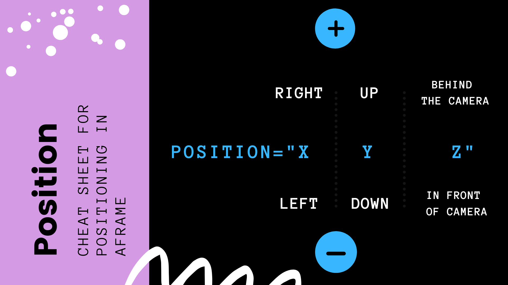
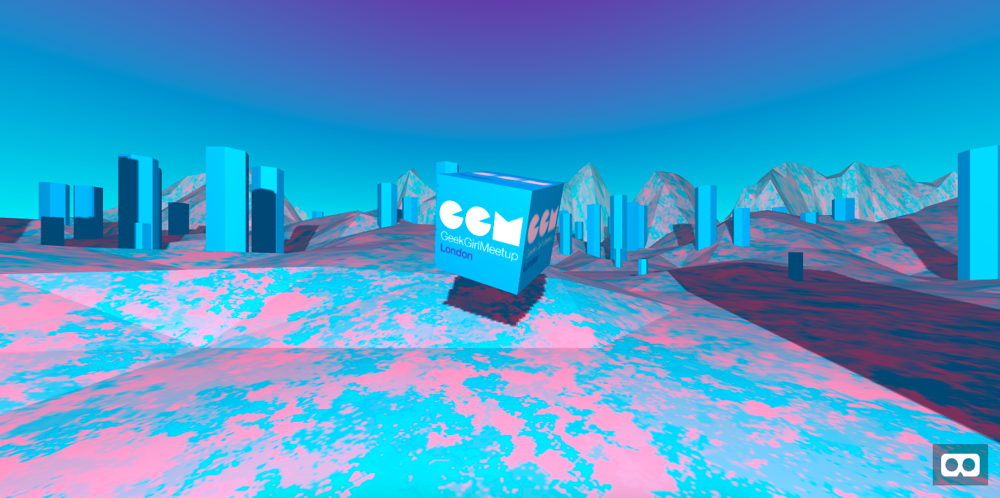

# Build Virtual Reality with HTML

This is the demo for the talk I gave in November at the Girl Geek Meetup x SnapChat on how you can easily build virtual reality using the framework A-Frame. 

Here is the slide I used to explain a little bit more how positioning works in A-Frame:

----

Here is a visual of the final product: 

You can view and remix the demo here: glitch.com/~ggm
